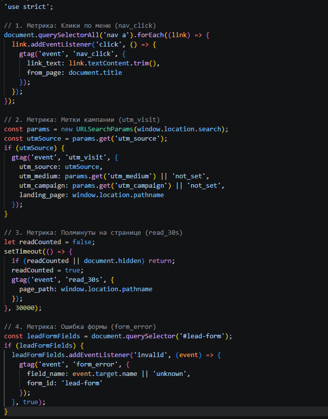
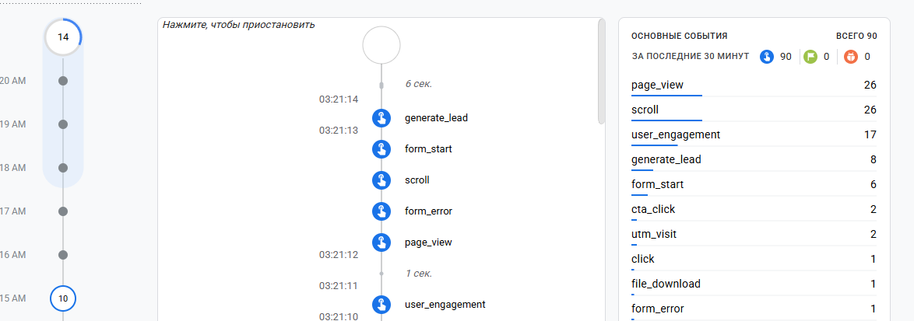
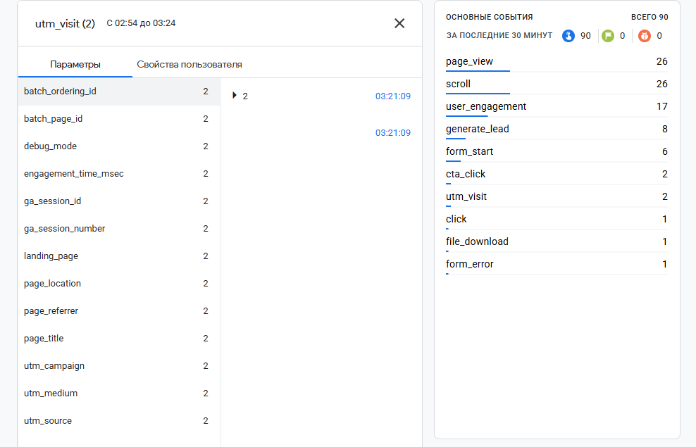
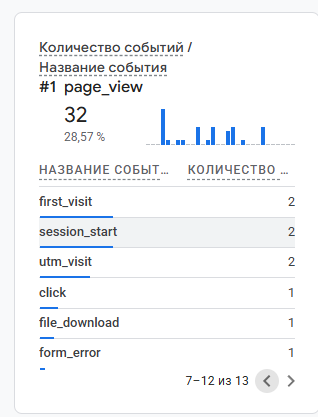

# Домашняя работа № 4 · Свои события и параметры в GA4

**Дисциплина:** ОП.03 «Информационные технологии»

| Поле | Значение |
| :--- | :--- |
| Фамилия, имя, отчество | Оскар Товстенко |
| Группа | 9\2-РПО-25\1 |
| Номер работы | 4 |
| Тема работы | Свои события и параметры: четыре метрики на сайте |
| Дата сдачи | 8.10.2026 |
| Ветка | `hw-04` |

---

## 1. Мой сайт и мой ресурс

| Поле | Значение |
| :--- | :--- |
| Публичный адрес сайта | https://ga4-analytics-lab-main.vercel.app |
| Measurement ID ( G-... ) | G-Q951VEJ3EP |
| Коммит с метриками (ссылка или первые 7 символов) | 4dc8ed68e0b4c8fafa893381ef9b885493d9d814 |
| Статус публикации | READY |
| Страницы, где подключён `js/metrics.js` | index.html, about.html, contacts.html |

*Файл подключается после основного скрипта и на каждой странице по одному разу: два подключения дают двойные события.*

## 2. Какие метрики добавлены

| Событие | Что измеряет | Что делали, чтобы оно сработало |
| :--- | :--- | :--- |
| `nav_click` | клики по пунктам меню | Нажал на ссылку в навигационном меню сайта. |
| `utm_visit` | метки кампании из адреса | Открыл сайт по ссылке с добавленными UTM-метками. |
| `read_30s` | полминуты на странице | Открыл страницу и подождал 30 секунд, не сворачивая вкладку. |
| `form_error` | форма не прошла проверку браузера | Попытался отправить пустую форму с обязательными полями. |

## 3. События в DebugView

| Поле | Значение |
| :--- | :--- |
| Дата и время проверки | [08.10.2026 3:00] |
| Как подключали отладку | Tag Assistant |
| Какие из четырёх событий пришли | `nav_click`, `utm_visit`, `read_30s`, `form_error` |
| Какие не пришли и почему | Все четыре события успешно дошли до отладки. |

## 4. Параметры события `utm_visit`

**Ссылка, по которой открывали сайт:**
`https://ga4-analytics-lab-main.vercel.app/?utm_source=telegram&utm_medium=social&utm_campaign=ga4_lab`

| Параметр | Значение в ссылке | Значение в GA4 |
| :--- | :--- | :--- |
| `utm_source` | telegram | telegram |
| `utm_medium` | social | social |
| `utm_campaign`| ga4_lab | ga4_lab |
| `landing_page`| — | / |

*Если значение в GA4 отличается от значения в ссылке, напишите, в чём разница и почему так вышло.*  
Все значения полностью совпали с параметрами из ссылки.

## 5. Событие вне отладки

| Поле | Значение |
| :--- | :--- |
| Где проверяли | Realtime |
| Какое событие искали | `nav_click` |
| Сколько срабатываний показал экран | 1 |
| Период (для отчёта) | последние 30 минут |

## 6. Что эти метрики показывают про сайт

**Два-три предложения:**  
Новые метрики позволяют детально отслеживать поведение пользователей: переходы по меню (`nav_click`) показывают интерес к разделам, а UTM-метки (`utm_visit`) фиксируют рекламный трафик. Таймер `read_30s` помогает оценить вовлеченность и реальное чтение страниц, а `form_error` подсвечивает проблемные места при заполнении формы.